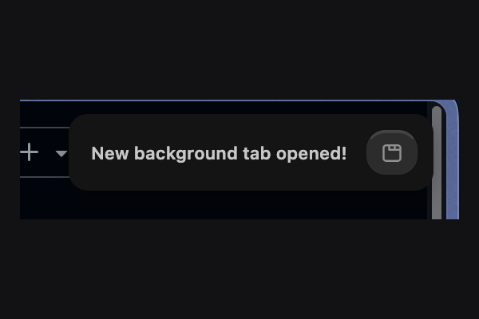

<div align="center">



# zen-hush

**Notification management for [Zen Browser](https://zen-browser.app).**

Two independent components: a CSS mod that restyles the background-tab toast, and a WebExtension that suppresses web notifications on a schedule.

<p>
  
  
  
  
</p>

</div>

---

## Overview

Zen Mods are CSS and a settings manifest, with no JavaScript — sufficient for how a toast looks, insufficient for whether it should fire at 2am. The two concerns are therefore separate.

| Component | Controls | Installation |
|---|---|---|
| **`mod/`** | Appearance of the built-in background-tab toast | Copy a file into the profile's `chrome/` directory |
| **`extension/`** | Whether web notifications are delivered at all | Load through `about:debugging` |

Either may be used independently.

## Requirements

A recent Zen Browser build. The mod additionally requires `toolkit.legacyUserProfileCustomizations.stylesheets` set to `true` in `about:config`. The extension declares `strict_min_version` 115.

## mod — toast restyling

Targets `hbox.zen-toast`, the element controlled by `zen.view.compact.show-background-tab-toast`.

> This selector was confirmed by inspecting a live toast in the Browser Toolbox. Other published Zen mods reference `#zen-toast-container` and `.description`; this build's markup is flatter, with no container wrapper and an unclassed `<label>` for the text. Verify against your own build rather than copying selectors.

Every property is a CSS variable, adjustable from the Marketplace settings panel or by editing the fallbacks in `chrome.css`: visibility, opacity, background, blur radius, corner radius, text size, maximum width, edge offset, and fade duration.

Shipped defaults are a solid background with no blur, which reads more clearly against a detailed desktop than the original glass treatment.

### Installation

```sh
PROFILE=~/Library/Application\ Support/zen/Profiles/<your-profile>.default
cp mod/chrome.css "$PROFILE/chrome/zen-hush.css"
```

Add to `userChrome.css` in the same directory:

```css
@import url("zen-hush.css");
```

Enable `toolkit.legacyUserProfileCustomizations.stylesheets`, then quit Zen entirely with `Cmd+Q` — closing the window is insufficient — and reopen.

## extension — quiet hours and per-site muting

Restyling a toast cannot prevent a notification; that requires intercepting the call between page and browser.

zen-hush replaces `window.Notification` with a wrapper of equivalent shape. During quiet hours, or on a muted host, constructing one yields an inert object rather than a system notification. The interface is preserved, so page scripts assigning `.onclick` or calling `.close()` continue to work. Quiet hours wrap across midnight, so `22:00 → 07:00` behaves as expected.

### Installation

```
about:debugging#/runtime/this-firefox → Load Temporary Add-on → extension/manifest.json
```

Temporary add-ons are removed when the browser restarts. The extension is not yet signed or published to AMO.

## Extension architecture

Three scripts, because no single execution context has access to everything required.

| Script | Context | Role |
|---|---|---|
| `inject.js` | MAIN world | Replaces `window.Notification` — the only context where that is possible. No `browser.*` access |
| `bridge.js` | Isolated world | Seventeen lines relaying `postMessage` between page and extension |
| `background.js` | Extension | Holds settings; answers whether a host is currently silenced |

### The initialisation race

Rule retrieval is asynchronous, but a page can construct a notification at `document_start`, before the response arrives. Notifications created in that window originally bypassed the filter entirely, which presented as intermittent failure.

The wrapper now queues anything constructed before rules load, then dispatches or discards each entry once they arrive. An entry closed while queued stays discarded, so a cancelled notification cannot reappear.

## Troubleshooting

| Symptom | Cause |
|---|---|
| Toast unchanged after restart | The stylesheets preference is not `true`, the `@import` is commented out, or Zen was closed rather than quit |
| CSS loads but has no effect | The build's toast markup differs. Inspect it with the Browser Toolbox (`Cmd+Alt+Shift+I`) |
| Toast disappears before inspection | Attach a `MutationObserver` in the Browser Toolbox console and log `outerHTML` on insertion |
| A muted site still notifies | The mute list keys on `location.hostname` exactly, so `www.example.com` and `example.com` are separate entries |
| Extension absent after restart | Expected behaviour for temporary add-ons; reload from `about:debugging` |

## Project structure

```
zen-hush/
├── mod/
│   ├── chrome.css          .zen-toast styling, fully variable-driven
│   ├── preferences.json    Marketplace settings schema
│   └── screenshot.png
└── extension/
    ├── manifest.json       MV3, two content scripts — one per world
    ├── inject.js           Notification wrapper and pending queue
    ├── bridge.js           MAIN ↔ isolated relay
    ├── background.js       Settings, quiet-hours logic, mute list
    └── options.html/.js    Configuration interface
```

## Status

Functional and in daily use. Not yet submitted to the Zen Marketplace or AMO, so the mod is installed by file copy and the extension as a temporary add-on.

## License

MIT — see [LICENSE](LICENSE).

## Contributors

| | |
|---|---|
| [chakri192](https://github.com/chakri192) | Author |
| [aider](https://github.com/Aider-AI/aider) | AI pair programmer |
